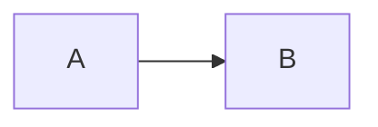

# Mermaid Diagrams

Architecture, deployment, and flow diagrams for the Library Hall Booking System, written in [Mermaid](https://mermaid.js.org).

## Files

| File | What it shows |
| ---- | ------------- |
| `01-system-architecture.mmd`    | All running services and how they talk on the Docker network. |
| `02-deployment-architecture.mmd`| AWS-side view: VPC → security group → EC2 → containers + volumes. |
| `03-cicd-pipeline.mmd`          | GitHub Actions jobs (backend / frontend / docker) and how they push to GHCR. |
| `04-devops-lifecycle.mmd`       | End-to-end DevOps lifecycle: local dev → CI → provisioning → deploy → monitor. |
| `05-database-er.mmd`            | Entity–relationship diagram for `users`, `rooms`, `bookings`. |
| `06-booking-sequence.mmd`       | Sequence diagram for the "user books a room" request, including overlap check and metrics. |
| `07-request-flow.mmd`           | A single HTTP request from browser through Nginx → middleware chain → Postgres. |
| `08-monitoring.mmd`             | `prom-client` → `/metrics` → Prometheus → Grafana dashboard. |

## How to render

### 1. GitHub (zero setup)

GitHub natively renders `.mmd` blocks **inside `.md` files**. To embed a diagram in `README.md` or `PROJECT_REPORT.md`, wrap the contents in a fenced block:

````md

````

### 2. Mermaid Live Editor (preview / export)

1. Open <https://mermaid.live>.
2. Paste the contents of any `.mmd` file.
3. Export as **PNG** or **SVG** from the menu — handy for slides and the PROJECT_REPORT.

### 3. CLI (`mmdc`) — batch export

Install once:
```bash
npm install -g @mermaid-js/mermaid-cli
```

Render everything in this folder to PNG:
```bash
cd mermaid
for f in *.mmd; do
  mmdc -i "$f" -o "${f%.mmd}.png" -b white -w 1600
done
```

Tip: pass `-t neutral` for a light theme, `-t dark` for dark.

### 4. VS Code

Install the **Markdown Preview Mermaid Support** extension (`bierner.markdown-mermaid`). `.mmd` blocks then render live in the preview pane.

## Where these are referenced

- **README.md** — embed `01-system-architecture` near the top.
- **PROJECT_REPORT.md** — embed `02`, `03`, `04`, `05`, `08` under the matching headings.
- **PRESENTATION_OUTLINE.md** — `04` (lifecycle) is the centrepiece slide.

## Tweaking

These are plain text. Edit a `.mmd`, refresh the preview, and re-export. Common knobs:

- `flowchart LR` (left-to-right) vs `flowchart TB` (top-to-bottom).
- `classDef name fill:#hex,stroke:#hex` to recolour groups.
- `-->|label|` adds an edge label.
- `subgraph "Title"` groups nodes inside a box; close with `end`.
